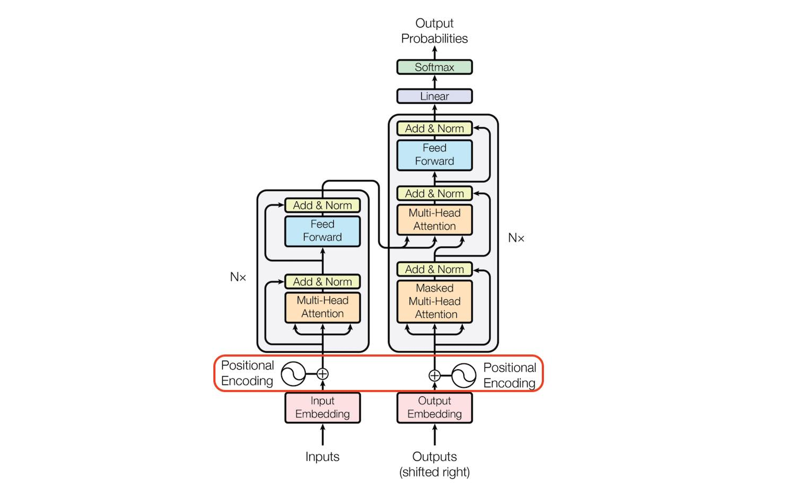
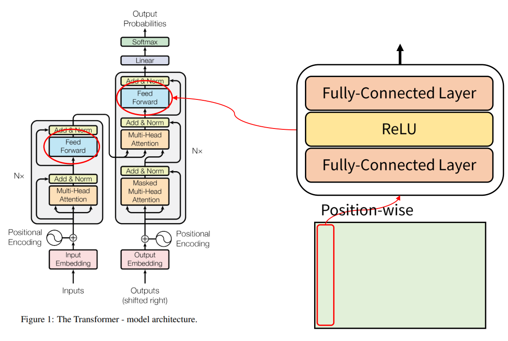

# Transformer (PyTorch)

[🇰🇷 한국어](README.md) | [🇺🇸 English](README.en.md)
> **Attention Is All You Need**를 기반으로 Transformer를 처음부터 구현한 PyTorch 프로젝트입니다.

<br>
<p align="left">
  
</p>
<p align="left">
  <em>그림. Transformer 아키텍처</em>
</p>

## 개요

이 저장소는 원본 Transformer 아키텍처를 학습 중심으로 구현한 프로젝트입니다.
README에는 논문을 따라가며 작성한 학습 노트를 보존하고,
`src/` 디렉터리에는 해당 노트를 재사용 가능한 PyTorch 모듈로 구현했습니다.

주요 학습 내용:

- `sqrt(d_model)`을 사용한 토큰 임베딩 스케일링
- 사인·코사인 위치 인코딩
- 스케일드 닷 프로덕트 어텐션과 멀티헤드 어텐션
- 인코더 셀프 어텐션, 디코더 마스크드 셀프 어텐션 및 인코더-디코더 어텐션
- 잔차 연결, 드롭아웃 및 LayerNorm
- teacher forcing을 사용한 시퀀스-투-시퀀스 학습

## 목차

- [논문 참고 자료](#논문-참고-자료)
- [실행 가능한 구현](#실행-가능한-구현)
- [학습 노트](#학습-노트)
  - [1단계. 데이터셋](#1단계-데이터셋)
  - [2단계. 토크나이저](#2단계-토크나이저)
  - [3단계. 임베딩](#3단계-임베딩)
  - [4단계. 어텐션](#4단계-어텐션)
  - [5단계. 피드포워드 네트워크](#5단계-피드포워드-네트워크)
  - [6단계. 모델링](#6단계-모델링)
  - [7단계. 실행](#7단계-실행)
  - [8단계. 평가](#8단계-평가)

## 논문 참고 자료

이 구현은 다음 논문을 기반으로 합니다.

> **Attention Is All You Need**  
> Ashish Vaswani, Noam Shazeer, Niki Parmar, Jakob Uszkoreit,  
> Llion Jones, Aidan N. Gomez, Łukasz Kaiser, Illia Polosukhin  
> *신경정보처리시스템학회(NeurIPS), 2017*

arXiv: https://arxiv.org/abs/1706.03762
<br>

## 실행 가능한 구현

아래 학습 노트는 이제 실행 가능한 PyTorch 코드로 구현되어 있습니다.

- `src/transformer_pytorch/model.py`: 토큰 임베딩, 사인·코사인 위치 인코딩, 멀티헤드 어텐션, 피드포워드 네트워크, 인코더 레이어, 디코더 레이어 및 전체 인코더-디코더 Transformer.
- `examples/toy_forward.py`: 예상되는 `(batch, target_length, vocab_size)` 출력 형태를 검증하는 작은 forward-pass 예제.
- `tests/test_transformer.py`: 출력 형태, 위치 인코딩 및 causal masking에 초점을 맞춘 테스트.

```bash
pip install -e ".[dev]"
PYTHONPATH=src python examples/toy_forward.py
PYTHONPATH=src pytest -q
```

이 구현은 README의 학습 흐름을 유지합니다. 임베딩은 `sqrt(d_model)`로
스케일링하고, 위치 인코딩은 시퀀스 순서를 제공하며, 어텐션은
`QK^T / sqrt(d_k)`를 사용합니다. 디코더는 causal mask를 사용하고,
모든 블록은 어텐션과 피드포워드 레이어 주위에 잔차 Add & Norm을 적용합니다.

---

## 학습 노트

다음 섹션에는 원본 학습 노트와 코드 조각을 보존했습니다.
위의 실행 가능한 구현으로 구성하기 전에 각 구성 요소를 어떻게
이해했는지 보여줍니다.

## 1단계. 데이터셋

```python
#data 로드
data=load_dataset("bentrevett/multi30k")

train=data['train']
valid=data['validation']
test=data['test']
train_en=train['en']
train_de=train['de']
```
<br>

---
## 2단계. 토크나이저
Hugging Face Transformers의 AutoTokenizer를 사용합니다.

```py
# tokenizer 설정
tokenizer=AutoTokenizer.from_pretrained("bert-base-uncased")

# 배치학습을 위해 128개씩 배치 세트 들어옴. 그럼 128개에 대한 토큰화 진행 후 반환
def collate_fn(batch):
    texts = [x["en"] for x in batch]
    texts2=[x["de"] for x in batch]

    enc = tokenizer(
        texts,
        padding=True,
        return_tensors="pt",
        return_token_type_ids=False
    )
    dec = tokenizer(
        texts2,
        padding=True,
        return_tensors="pt",
        return_token_type_ids=False
    )
    return enc,dec

# 리스트화
res=[k for k in train]
```
<br>

---
## 3단계. 임베딩

<p align="left">
  
</p>
<br>
임베딩 + 위치 인코딩
<br>

```py
class TokenEmbedding(nn.Module):
  def __init__(self,vocab_size: int, d_model: int):
    super().__init__()
    self.d_model=d_model
    self.embed=nn.Embedding(vocab_size,d_model)

  def embedding(self,input_ids: torch.Tensor)->torch.Tensor:
    x=self.embed(input_ids) #임베딩
    return x*math.sqrt(self.d_model) #루트 d_model 곱해주기

  def positional_encoding(self,embedding_input_ids:torch.Tensor)->torch.Tensor:
    B,T,d_model=embedding_input_ids.shape

    # 0으로된 T,d_model 2차원 벡터 생성
    pe=torch.zeros(T,d_model,device=embedding_input_ids.device,dtype=embedding_input_ids.dtype)

    pe[:,::2]=torch.sin(T*torch.exp(-torch.div(d_model,512)*math.log(10000)))
    pe[:,1::2]=torch.cos(T*torch.exp(-torch.div(d_model,512)*math.log(10000)))

    # print(embedding_input_ids[0])
    # print(pe[0])

    return embedding_input_ids+pe
```
<br>

---
## 4단계. 어텐션

<p align="left">
  
</p>
<br>

인코딩 어텐션, 디코딩 어텐션, 디코딩의 인코딩+디코딩 어텐션 <br>
(B,T,d_model) -> (B,T,d_model) 동일한 차원
<br>

```py
class Attention(nn.Module):
  def __init__(self,d_k,d_v,d_model):
    super().__init__()
    self.d_k=d_k
    self.d_v=d_v
    self.d_model=d_model

    self.q_linear_proj=nn.Linear(self.d_model,self.d_model)
    self.k_linear_proj=nn.Linear(self.d_model,self.d_model)
    self.v_linear_proj=nn.Linear(self.d_model,self.d_model)
    self.o_linear_proj=nn.Linear(self.d_model,self.d_model)

    self.dropout=nn.Dropout(p=0.1)
    self.norm=nn.LayerNorm(d_model)

  def forward(self,query,key,value,mask=None): # Q in decoding, K,V in encoding
    Q=self.q_linear_proj(query)
    K=self.k_linear_proj(key)
    V=self.v_linear_proj(value)
    self.B,self.T,self.d_model=query.size() # 차원 다르기 때문에 맞춰줘야함 Q ,(K,V)
    self.B2,self.T2,self.d_model2=value.size()
    #devide d_model
    Q=Q.view(self.B,self.T,8,self.d_k).transpose(1,2)
    K=K.view(self.B2,self.T2,8,self.d_k).transpose(1,2)
    V=V.view(self.B2,self.T2,8,self.d_v).transpose(1,2)

    #scaled dot-product attention
    if mask != None: # mask 존재->masking attention in decorder
      res=res=torch.softmax((Q @ K.transpose(-2,-1)/math.sqrt(self.d_k))+mask, dim=-1) @ V
    else: # None mask-> self-attention in encoder,decoder
      res=torch.softmax(Q @ K.transpose(-2,-1)/math.sqrt(self.d_k), dim=-1) @ V

    # concat
    res=res.transpose(1,2)
    res=res.contiguous().view(self.B,self.T,8*self.d_v)

    # last linear projection
    O=self.o_linear_proj(res)

    #Add & Norm
    return self.norm(query+self.dropout(O))
```
<br>

---

## 5단계. 피드포워드 네트워크

<p align="left">
  
</p><br>

FeedForward 512->2048->512 <br>
활성화 함수로 ReLU를 사용합니다.
<br>

```py
class FeedForward(nn.Module):
  def __init__(self,d_model,d_layer):
    super().__init__()
    self.d_model=d_model
    self.d_layer=d_layer

    self.ffn=nn.Sequential(
        nn.Linear(self.d_model,self.d_layer),
        nn.ReLU(),
        nn.Dropout(p=0.1),
        nn.Linear(self.d_layer,self.d_model)

    )
    self.dropout=nn.Dropout(p=0.1)
    self.norm=nn.LayerNorm(d_model)

  def forward(self,data):
    x=self.ffn(data)
    x=self.norm(data+self.dropout(x))

    return x
```
<br>

---

## 6단계. 모델링
논문에서 nx=6 <br>
=> 인코딩 * 6, 디코딩 * 6<br>

```py
class transformer(nn.Module):
  def __init__(self):
    super().__init__()
    self.d_model=512
    self.d_layer=2048
    self.out_proj=nn.Linear(self.d_model,tokenizer.vocab_size) # 마지막 선형변환
    self.embedding_data=TokenEmbedding(tokenizer.vocab_size,512) #token
    self.attention=Attention(64,64,512)
    self.ffw=FeedForward(self.d_model,self.d_layer)
    


  def forward(self,input_ids_enc,tgt_in):

    k_encoding=self.embedding_data.embedding(input_ids_enc) #embedding in encoding
    k_decoding=self.embedding_data.embedding(tgt_in) # embedding in decoding
    start_encoding=self.embedding_data.positional_encoding(k_encoding) #token,embedding,positional in encoding
    start_decoding=self.embedding_data.positional_encoding(k_decoding) #token,embedding, positional in decoding

  #------------------ encoder --------------------
    for _ in range(6): #6번 반복 nx=6

      #multi-head self attention in encoding 실행
      x=self.attention.forward(start_encoding,start_encoding,start_encoding)

      start_encoding=self.ffw.forward(x) #encoding end

  #------------------ decoder --------------------
    #print("encoding.size=",start_encoding.size())
    #print("decoding.size=",start_decoding.size())
    for _ in range(6):
      B,T,d_model=start_decoding.size() # decoding T 활용한 masked vector 생성
      mask=torch.ones(T,T,device=input_ids_enc.device)
      mask=torch.triu(mask,diagonal=1)
      mask=mask.masked_fill(mask==1, float('-inf')) # i<j = -inf, i>=j = 0

      # masking attention in decoding
      x=self.attention.forward(start_decoding,start_decoding,start_decoding,mask)

      # encoding+decoding attention
      start_decoding=self.attention.forward(x,start_encoding,start_encoding)

      # FFW
      start_decoding=self.ffw.forward(start_decoding)

    #print(start_decoding[0])

    # Linear in decoding
    last=self.out_proj(start_decoding)
    return last
```
<br>

---

## 7단계. 실행

```py
model=transformer()

device=torch.device("cuda" if torch.cuda.is_available() else "cpu")
model.to(device)

loader = DataLoader(res, batch_size=128, shuffle=True, collate_fn=collate_fn)
valid_loader = DataLoader(valid, batch_size=128, shuffle=False, collate_fn=collate_fn)
test_loader = DataLoader(test, batch_size=128, shuffle=False, collate_fn=collate_fn)

device=torch.device("cuda" if torch.cuda.is_available() else "cpu")
model.to(device)

epoch=50
train_loss=[]
valid_loss=[]
v_loss=[]

optimizer=torch.optim.Adam(
    model.parameters(),
    betas=(0.9,0.98),
    eps=1e-9
    )

vocab_size=tokenizer.vocab_size
criterion=nn.CrossEntropyLoss(ignore_index=0)

for i in range(epoch):
  model.train()
  total_loss=0

  progress_bar = tqdm(loader, desc=f"Epoch {i+1}/{epoch}", leave=True)

  for enc,dec in progress_bar:


    input_ids_enc = {k: v.to(device) for k, v in enc.items()}
    input_ids_dec = {k: v.to(device) for k, v in dec.items()}

    #input_ids_enc = enc["input_ids"] #encoder
    #attention_mask_enc = enc["attention_mask"]

    #input_ids_dec=dec["input_ids"] #decoder
    #attention_mask_dec=dec["attention_mask"]

    tgt_in=input_ids_dec['input_ids'][:,:-1] # eos 제거  학습용 in decoding
    tgt_out=input_ids_dec['input_ids'][:,1:] # bos 제거  loss 전용 in decoding

    logits=model(input_ids_enc['input_ids'],tgt_in)

    loss=criterion(
        logits.reshape(-1,vocab_size),
        tgt_out.reshape(-1)
    )

    optimizer.zero_grad()
    loss.backward()
    optimizer.step()

    #train_loss.append(loss.item())
    total_loss+=loss.item()

  avg_loss=total_loss/len(loader)
  train_loss.append(avg_loss)

  v_loss.append(eval_loss(model, valid_loader, criterion, vocab_size, device, pad_id=0))
  #valid_loss.append(v_loss)
  


```


### 검증 손실 함수
```py
criterion=nn.CrossEntropyLoss(ignore_index=0)

def eval_loss(model, loader, criterion, vocab_size, device, pad_id=0):
    model.eval()
    total_loss = 0.0

    with torch.no_grad():
        for enc, dec in loader:
            input_ids_enc = {k: v.to(device) for k, v in enc.items()}
            input_ids_dec = {k: v.to(device) for k, v in dec.items()}

            tgt_in  = input_ids_dec["input_ids"][:, :-1]
            tgt_out = input_ids_dec["input_ids"][:,  1:]

            logits = model(input_ids_enc["input_ids"], tgt_in)  # [B, T-1, V]

            # sum loss over all non-pad tokens
            loss = criterion(
                logits.reshape(-1, vocab_size),
                tgt_out.reshape(-1)
            )
            total_loss += loss.item()
            #valid_loss.append(loss.item())

    avg_loss = total_loss / len(loader)
    return avg_loss
```
<br>

## 8단계. 평가

### 학습 손실 및 검증 손실 곡선
<p align="center">
  
</p>
<br>
